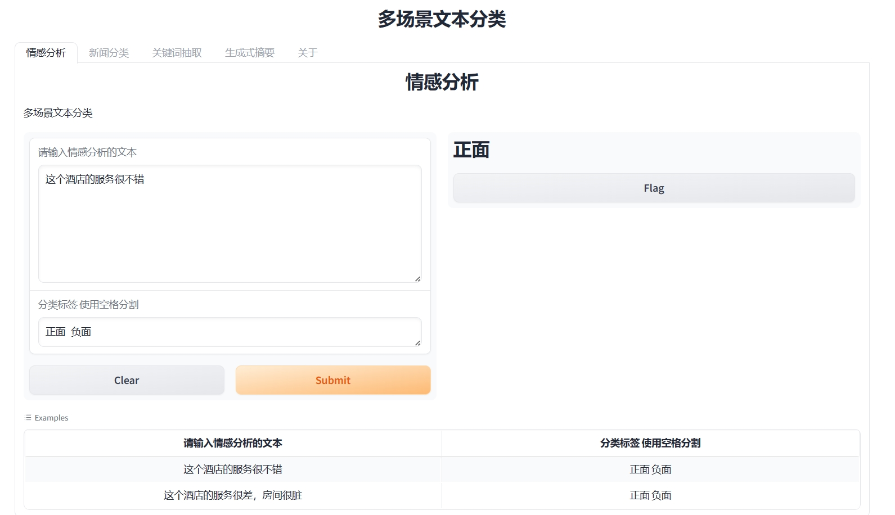
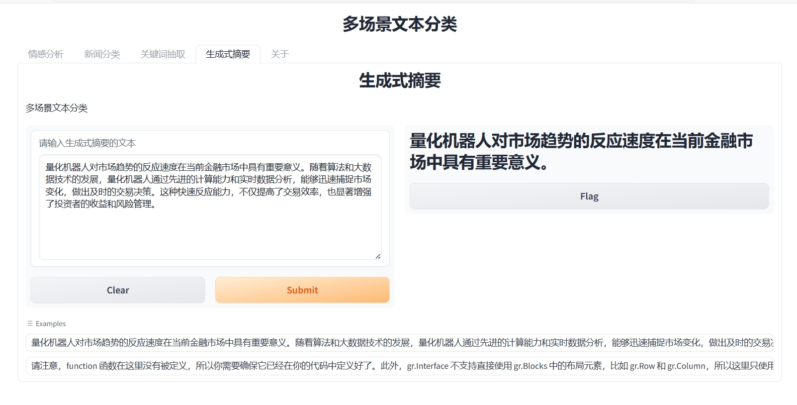

# Multi-Scene-Chinese-Text-Classification-Model

## 简介

这是一个基于[模型IDEA-CCNL/Randeng-T5-77M-MultiTask-Chinese](https://huggingface.co/IDEA-CCNL/Randeng-T5-77M-MultiTask-Chinese)
的应用，作为本人的学习笔记

应用功能，从[IDEA-CCNL/Randeng-T5-77M-MultiTask-Chinese](https://huggingface.co/IDEA-CCNL/Randeng-T5-77M-MultiTask-Chinese)
中选择了情感分析、新闻分类、关键词抽取、生成式摘要 封装成了[Gradio应用](https://www.gradio.app/docs).

## 食用方法

首先，您需要去[这里](https://huggingface.co/IDEA-CCNL/Randeng-T5-77M-MultiTask-Chinese/tree/main)
下载模型参数文件,如果您直接按照它给定的例子通过管道加载模型，可能会出现错误，因为它没有提供```vocab.txt```
,你可以先从[这里](https://huggingface.co/IDEA-CCNL/Randeng-T5-77M-MultiTask-Chinese/tree/main)
下载其他的文件，再将本仓库中的```vocab.txt```拷贝到下载的目录中，就可以使用了。

## 效果预览







## 说明
总的来说，[这个模型](https://huggingface.co/IDEA-CCNL/Randeng-T5-77M-MultiTask-Chinese)还是比较简单的，
模型不是很大，效果一般。因此，只适合作为学习使用，不可置于生产环境中哦。

## 获取帮助
```text
 @author :我不是大佬 
 @contact:2869210303@qq.com
 @wx     ;safeseaa
 @qq     ;2869210303
 @github ;https://github.com/U202142209
 @blog   ;https://blog.csdn.net/V123456789987654
 @B      ;https://space.bilibili.com/661047235?0
```